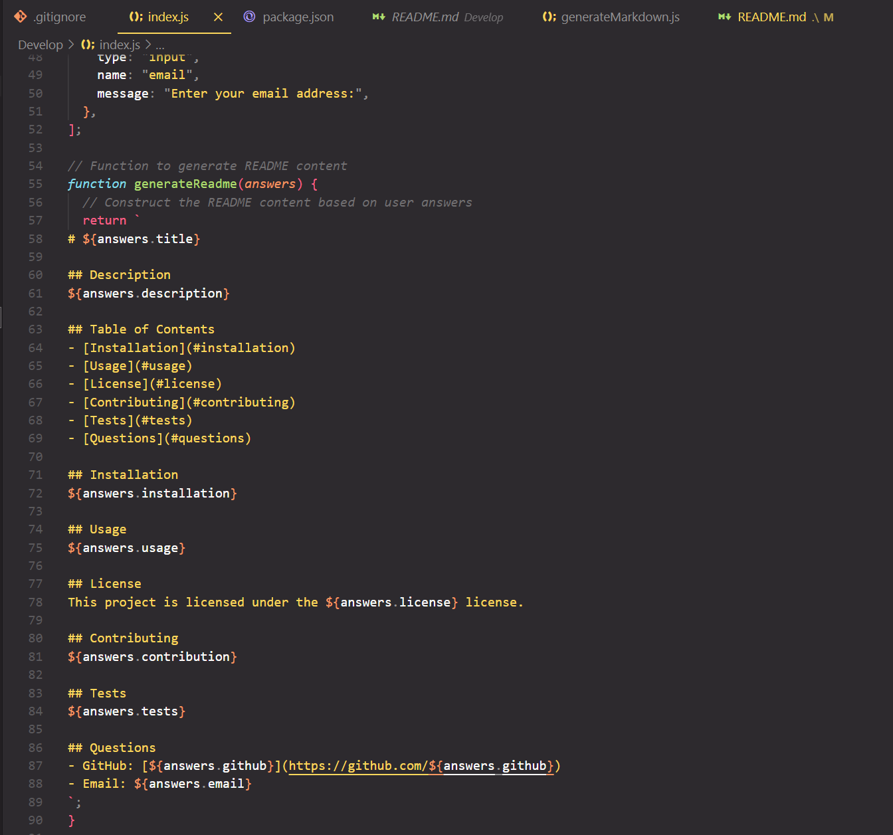
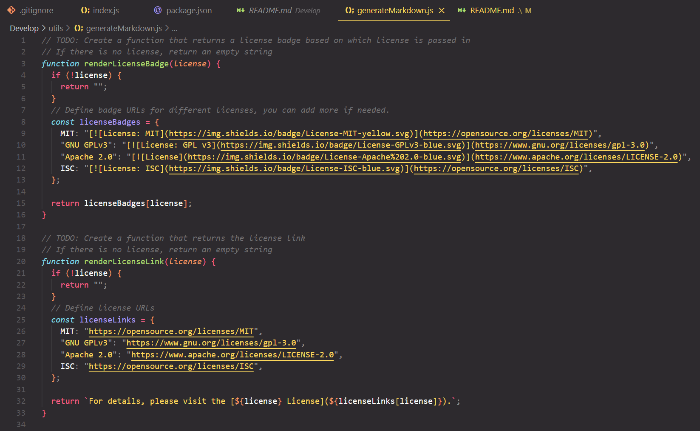
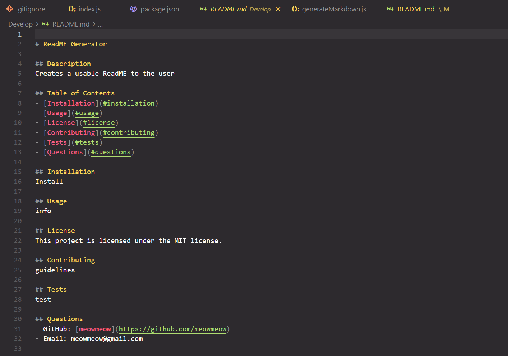

# ReadME Generator

## Website link

- https://github.com/Miekooooo/Challenge-9

## Instructions
1. Run "npm i"
2. Run "node index.js"
3. Follow the questions within the console

## Description
- A easy to use ReadMe generator using inquirer.

- "what was my motivation?" - To be able to easily create a ReadMe
- "why did I build this project?" - Learn more JS
- "what problem does it solve?" - Give users a good looking ReadMe without having to create their own by hand
- "what did I learn?" - How to create a ReadMe generator

## Features

- Inquirer 
- Easy console commands

## Video link 

- 

## Screenshots

- 
- 
- 

## Installation

- Could be a application a developer could run whenever they want a ReadMe

## Usage

- Could be added to a developer app as a tool to use

## Credits

-

## License 

MIT License

Copyright (c) [2023] [Locket Layne]

Permission is hereby granted, free of charge, to any person obtaining a copy
of this software and associated documentation files (the "Software"), to deal
in the Software without restriction, including without limitation the rights
to use, copy, modify, merge, publish, distribute, sublicense, and/or sell
copies of the Software, and to permit persons to whom the Software is
furnished to do so, subject to the following conditions:

The above copyright notice and this permission notice shall be included in all
copies or substantial portions of the Software.

THE SOFTWARE IS PROVIDED "AS IS", WITHOUT WARRANTY OF ANY KIND, EXPRESS OR
IMPLIED, INCLUDING BUT NOT LIMITED TO THE WARRANTIES OF MERCHANTABILITY,
FITNESS FOR A PARTICULAR PURPOSE AND NONINFRINGEMENT. IN NO EVENT SHALL THE
AUTHORS OR COPYRIGHT HOLDERS BE LIABLE FOR ANY CLAIM, DAMAGES OR OTHER
LIABILITY, WHETHER IN AN ACTION OF CONTRACT, TORT OR OTHERWISE, ARISING FROM,
OUT OF OR IN CONNECTION WITH THE SOFTWARE OR THE USE OR OTHER DEALINGS IN THE
SOFTWARE.